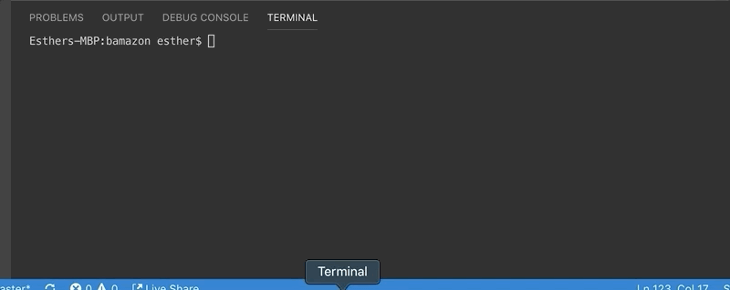

# Bamazon
## Purpose:

This app is an Amazon-like storefront site where customers can order and deplete stock from site's inventory.

## Instructions: 
There are 3 views to run (customer, manager, supervisor) with their respective files. Running the Customer view allows the user to see the full inventory stock details and place an order. Manager view allows the user to check the product/inventory and restock. Supervisor view allows user to check summarized sales by departments.

EX: Customer View

EX: Manager View

EX: Supervisor View  

### Technologies Used: 
Node (mysql, inquirer node packages) written with SQL and JS

#### Developed by: Esther Lee
